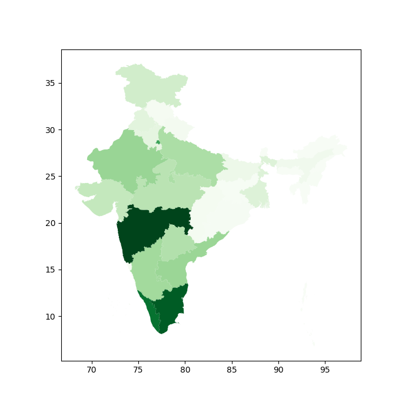

# DataVisualization
## Geographically, visualiza corona cases in Indian states

### Install the requirement
we are using **geopandas** library to visualize data
> pip install -r requirements.txt

### Get dataset for corona cases statewise
> corona_cases.txt

### Get the shapefile
- _A shapefile is vector data storage format for storing the location, shape, and attributes of geographic features_
- You can download the shapefile from [here](https://map.igismap.com/share-map/export-layer/Indian_States/06409663226af2f3114485aa4e0a23b4).
> Indian_States.shp

### Run all the cells

### Output

